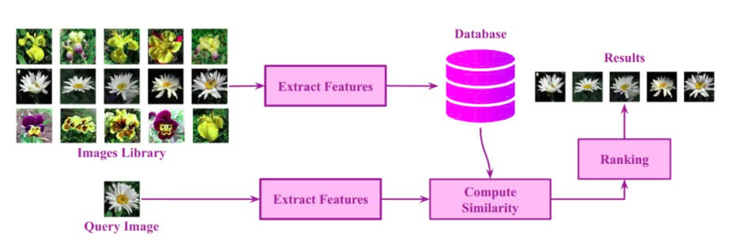
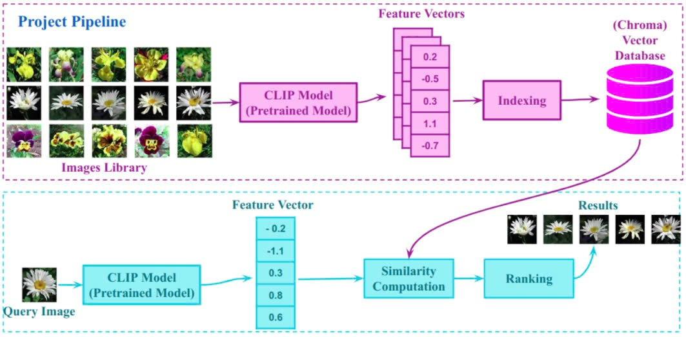
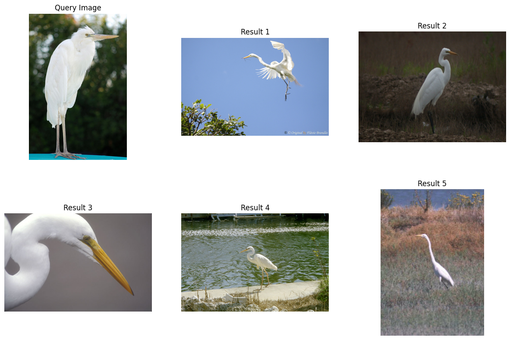
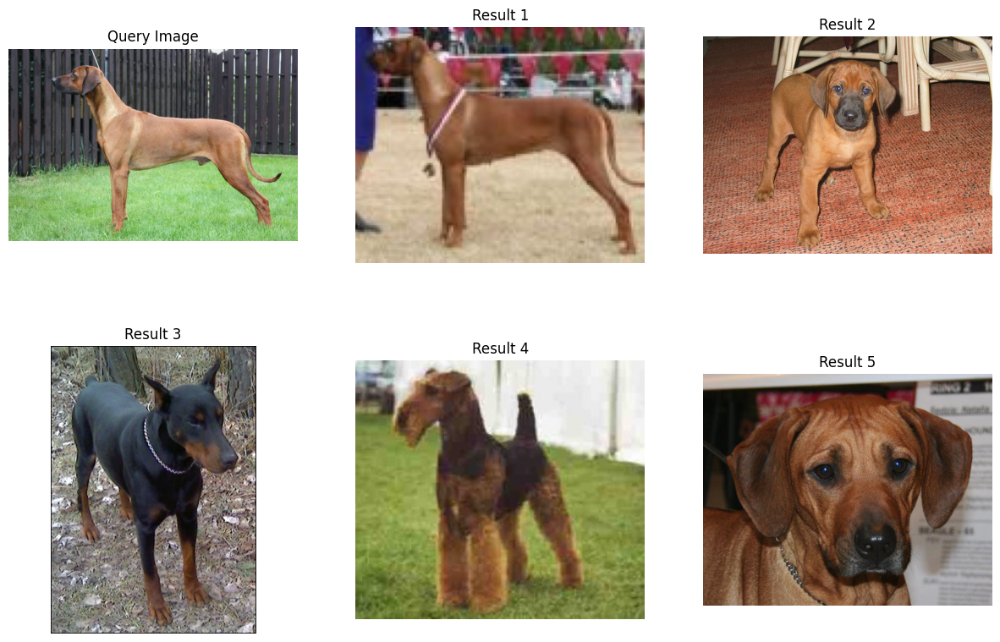

# Image-Retrieval
Query Image in Database
## Pipeline of Image Retrieval 

<div style="text-align: center;">
    
    <div style="text-align: center;"><em>Figure 1: Query with raw features</em></div>
</div>

<div style="text-align: center; margin-top: 20px;">
    
    <div style="text-align: center;"><em>Figure 2: Query with features extraction</em></div>
</div>

## 1. How to run 
1. Clone this repository 
```
git clone https://github.com/VayneMai020301/Image-Retrieval.git
```
## 2. Setup Environemnt

```python
pip install onnxruntime (CPU)
pip install onnxruntime-gpu (GPU)
pip install chromadb
pip install open-clip-torch
pip install stream-lit
```
## 3. How to plot the results without database building 
* With 'l1' (Absolute Difference Score)
``` python
python main.py -m 'l1' -pretrained 'True'
python main.py -m 'l1' -pretrained 'False'
```

* With 'l2' (Mean Square Error)
``` python 
python main.py -m 'l2' -pretrained 'True'      
python main.py -m 'l2' -pretrained 'False'     
```

* With 'cosine' (Cosine Similarity Score)
```python 
python main.py -m 'cosine' -pretrained 'True'      
python main.py -m 'cosine' -pretrained 'False'   
```

* With 'coeff' (Correlation Coefficient Score)
```python 
python main.py -m 'coeff' -pretrained 'True'      
python main.py -m 'coeff' -pretrained 'False'   
```
## 4. How to run with database (chromadb) building
* Step1: extract and save feature
```python 
python core/database.py                                                             
```

* Step2: Building chromadb and query (feature loading -> build chromadb): 
    run file Md2_Image_Retrieval.ipynb on google colab

## 5. Retrieval with raw image features and feature extraction (Using CLIP to extract features from image)
* In this method, we approach calculate distance of each pair image and give the pair have best of of score
* Score is distance followed formula below

$$L1 (\vec{a}, \vec{b}) = \sum_{i=1}^N {|a-b|}$$
$$L2 (\vec{a}, \vec{b}) = \sqrt{\sum_{i=1}^N {(a-b)^2}}$$


$$\text{cosine similarity}(\vec{a}, \vec{b}) = \frac{a \cdot b}{||a|| ||b||} = \frac{\sum_{i=1}^N(a_ib_i)}{\sqrt{\sum_{i=1}^N a_i ^2} \sqrt{\sum_{i=1}^N b_i ^2}}$$

$$\text{r} = \frac{X[(X- \mu_X)(Y- \mu_Y)]}{\sigma_X \cdot \sigma_Y} =  \frac{\sum (x_i - \mu_X)(y_i - \mu_Y)}{\sqrt{\sum (x_i - \mu_X)^2 \sum (y_i - \mu_Y)^2}}$$


## 6. Results
<div style="text-align: center;">
    
    <div style="text-align: center;"><em>Figure 1: Query using L2 Distance</em></div>
</div>

<div style="text-align: center; margin-top: 20px;">
    
    <div style="text-align: center;"><em>Figure 2: Query using Cosine Distance</em></div>
</div>
